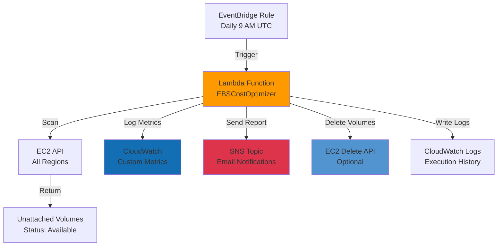

# EBS Cost Optimizer

An automated AWS Lambda-based solution to identify, monitor, and manage unattached EBS volumes across all regions, helping reduce storage costs through intelligent resource optimization.

## Architecture Overview



## Features

- **Multi-Region Scanning**: Automatically scans all AWS regions for unattached EBS volumes
- **Cost Analysis**: Calculates current monthly costs and potential savings
- **Intelligent Filtering**: Only flags volumes older than configured threshold (default: 7 days)
- **Safety First**: Dry-run mode by default to prevent accidental deletions
- **Detailed Reporting**: HTML-formatted email reports with comprehensive volume details
- **CloudWatch Integration**: Custom metrics for monitoring and alerting
- **Tag Protection**: Respects 'DoNotDelete' tags to prevent deletion of protected volumes
- **Automated Deletion**: Optional automatic cleanup of orphaned volumes
- **Zero Cost**: Runs entirely within AWS free tier limits

## AWS Services Used

### 1. AWS Lambda
- **Purpose**: Serverless compute to run the optimization logic
- **Runtime**: Python 3.11
- **Memory**: 256 MB
- **Timeout**: 300 seconds (5 minutes)
- **Trigger**: EventBridge scheduled event
- **Free Tier**: 1M requests/month + 400,000 GB-seconds compute time

### 2. Amazon EventBridge (CloudWatch Events)
- **Purpose**: Schedule Lambda function execution
- **Schedule**: Daily at 9:00 AM UTC (cron: `0 9 * * ? *`)
- **Cost**: Free for all rule evaluations

### 3. Amazon SNS (Simple Notification Service)
- **Purpose**: Send email notifications with volume reports
- **Protocol**: Email
- **Format**: HTML-formatted detailed reports
- **Free Tier**: 1,000 email notifications/month

### 4. Amazon CloudWatch
- **Purpose**: Logging, metrics, and monitoring
- **Logs**: Store Lambda execution logs and errors
- **Metrics**: Custom metrics for volume count, size, and estimated costs
- **Dashboard**: Visual monitoring of optimization metrics
- **Free Tier**: 5GB log ingestion + 5GB storage

### 5. AWS IAM (Identity and Access Management)
- **Purpose**: Permission management for Lambda function
- **Permissions**:
  - Read access to EC2 volumes across all regions
  - Delete access to EBS volumes (conditional)
  - Publish access to SNS topic
  - Write access to CloudWatch Logs and Metrics

### 6. Amazon EC2/EBS
- **Purpose**: Target service for volume management
- **Operations**: Describe volumes, describe regions, delete volumes
- **Scope**: All regions in the AWS account

## Project Structure

```
ebs-cost-optimizer/
├── lambda_function.py              # Main Lambda function code
├── iam_policy.json                 # IAM permissions policy
├── cloudwatch_event_rule.json      # EventBridge schedule configuration
├── sns_topic_policy.json           # SNS topic and subscription setup
├── requirements.txt                # Python dependencies
├── README.md                       # This file
├── deployment/
│   ├── deploy.sh                   # Automated deployment script
│   └── cleanup.sh                  # Resource cleanup script
└── architecture/
    └── architecture_diagram.png    # Visual architecture diagram
```

## Prerequisites

- AWS Account with appropriate permissions
- AWS CLI installed and configured
- Python 3.11 or later (for local testing)
- Email address for receiving notifications

## Step-by-Step Implementation

### Step 1: Create IAM Role

1. Navigate to IAM Console
2. Click "Roles" → "Create role"
3. Select "AWS service" → "Lambda"
4. Click "Next"
5. Create a custom policy using `iam_policy.json`:
   ```bash
   aws iam create-role --role-name EBSCostOptimizerRole \
     --assume-role-policy-document file://trust-policy.json
   
   aws iam put-role-policy --role-name EBSCostOptimizerRole \
     --policy-name EBSCostOptimizerPolicy \
     --policy-document file://iam_policy.json
   ```
6. Note the Role ARN for later use

**Trust Policy** (save as `trust-policy.json`):
```json
{
  "Version": "2012-10-17",
  "Statement": [
    {
      "Effect": "Allow",
      "Principal": {
        "Service": "lambda.amazonaws.com"
      },
      "Action": "sts:AssumeRole"
    }
  ]
}
```

### Step 2: Create SNS Topic

1. Navigate to SNS Console
2. Click "Topics" → "Create topic"
3. Select "Standard" type
4. Name: `EBS-Cost-Optimizer-Notifications`
5. Click "Create topic"
6. Note the Topic ARN
7. Create subscription:
   - Protocol: Email
   - Endpoint: your-email@example.com
8. Confirm subscription via email

**CLI Command**:
```bash
# Create topic
SNS_TOPIC_ARN=$(aws sns create-topic \
  --name EBS-Cost-Optimizer-Notifications \
  --query 'TopicArn' --output text)

# Subscribe email
aws sns subscribe --topic-arn $SNS_TOPIC_ARN \
  --protocol email \
  --notification-endpoint your-email@example.com
```

### Step 3: Create Lambda Function

1. Navigate to Lambda Console
2. Click "Create function"
3. Choose "Author from scratch"
4. Function name: `EBSCostOptimizer`
5. Runtime: Python 3.11
6. Architecture: x86_64
7. Permissions: Use existing role (select role from Step 1)
8. Click "Create function"
9. Copy code from `lambda_function.py` into the code editor
10. Configure environment variables:
    - `SNS_TOPIC_ARN`: Your SNS topic ARN from Step 2
    - `AUTO_DELETE`: `false` (set to `true` to enable auto-deletion)
    - `DRY_RUN`: `true` (set to `false` to actually delete volumes)
    - `VOLUME_AGE_DAYS`: `7` (minimum age for volumes to be flagged)
11. Configuration:
    - Memory: 256 MB
    - Timeout: 5 minutes (300 seconds)
12. Click "Deploy"

**CLI Command**:
```bash
# Package function
zip lambda_function.zip lambda_function.py

# Create function
aws lambda create-function \
  --function-name EBSCostOptimizer \
  --runtime python3.11 \
  --role arn:aws:iam::ACCOUNT_ID:role/EBSCostOptimizerRole \
  --handler lambda_function.lambda_handler \
  --zip-file fileb://lambda_function.zip \
  --timeout 300 \
  --memory-size 256 \
  --environment Variables="{
    SNS_TOPIC_ARN=arn:aws:sns:us-east-1:ACCOUNT_ID:EBS-Cost-Optimizer-Notifications,
    AUTO_DELETE=false,
    DRY_RUN=true,
    VOLUME_AGE_DAYS=7
  }"
```

### Step 4: Create EventBridge Rule

1. Navigate to EventBridge Console
2. Click "Rules" → "Create rule"
3. Name: `EBSCostOptimizerDailySchedule`
4. Description: "Triggers EBS Cost Optimizer daily at 9 AM UTC"
5. Rule type: Schedule
6. Schedule pattern: 
   - Type: Cron-based schedule
   - Cron expression: `0 9 * * ? *`
7. Target:
   - Type: AWS service
   - Select a target: Lambda function
   - Function: EBSCostOptimizer
8. Click "Create"

**CLI Command**:
```bash
# Create rule
aws events put-rule \
  --name EBSCostOptimizerDailySchedule \
  --schedule-expression "cron(0 9 * * ? *)" \
  --state ENABLED

# Add Lambda permission
aws lambda add-permission \
  --function-name EBSCostOptimizer \
  --statement-id EventBridgeInvoke \
  --action lambda:InvokeFunction \
  --principal events.amazonaws.com \
  --source-arn arn:aws:events:REGION:ACCOUNT_ID:rule/EBSCostOptimizerDailySchedule

# Add target
aws events put-targets \
  --rule EBSCostOptimizerDailySchedule \
  --targets "Id=1,Arn=arn:aws:lambda:REGION:ACCOUNT_ID:function:EBSCostOptimizer"
```

### Step 5: Create CloudWatch Dashboard (Optional)

1. Navigate to CloudWatch Console
2. Click "Dashboards" → "Create dashboard"
3. Name: `EBSCostOptimizer`
4. Add widget:
   - Type: Line graph
   - Metrics:
     - Namespace: `EBS/CostOptimizer`
     - Metrics: `UnattachedVolumeCount`, `UnattachedVolumeSizeGB`, `EstimatedMonthlyCost`
5. Save dashboard

**CLI Command**:
```bash
aws cloudwatch put-dashboard \
  --dashboard-name EBSCostOptimizer \
  --dashboard-body file://dashboard.json
```

### Step 6: Test the Function

1. Navigate to Lambda Console
2. Select your function
3. Click "Test" tab
4. Create new test event:
   ```json
   {
     "source": "manual-test",
     "scheduled": false
   }
   ```
5. Click "Test"
6. Check execution results and CloudWatch Logs
7. Verify email notification is received

**CLI Command**:
```bash
aws lambda invoke \
  --function-name EBSCostOptimizer \
  --payload '{"source":"manual-test"}' \
  output.json

cat output.json
```

## Automated Deployment

Use the provided deployment script for quick setup:

```bash
# Make script executable
chmod +x deployment/deploy.sh

# Run deployment
./deployment/deploy.sh
```

The script will:
1. Create IAM role and attach policies
2. Create SNS topic and subscription
3. Package and deploy Lambda function
4. Create EventBridge schedule
5. Create CloudWatch dashboard
6. Configure all connections

## Configuration Options

### Environment Variables

| Variable | Default | Description |
|----------|---------|-------------|
| `SNS_TOPIC_ARN` | Required | ARN of SNS topic for notifications |
| `AUTO_DELETE` | `false` | Enable automatic deletion of volumes |
| `DRY_RUN` | `true` | Prevent actual deletions (safety mode) |
| `VOLUME_AGE_DAYS` | `7` | Minimum age in days for volumes to be flagged |

### Safety Features

1. **Dry Run Mode**: Enabled by default, reports volumes but doesn't delete
2. **Tag Protection**: Volumes with `DoNotDelete=true` tag are never deleted
3. **Age Threshold**: Only flags volumes older than configured days
4. **Multi-region Support**: Scans all regions but handles errors gracefully

## How It Works

### Execution Flow

1. **Trigger**: EventBridge invokes Lambda function daily at 9 AM UTC
2. **Region Discovery**: Function queries all available AWS regions
3. **Volume Scan**: For each region:
   - Queries all volumes with status "available" (unattached)
   - Filters volumes older than configured threshold
   - Collects volume metadata (size, type, age, tags)
4. **Cost Calculation**: 
   - Calculates storage cost per volume (size × $0.08/GB-month)
   - Aggregates total cost across all regions
5. **Metric Logging**: Sends custom metrics to CloudWatch:
   - `UnattachedVolumeCount`: Total number of unattached volumes
   - `UnattachedVolumeSizeGB`: Total storage in GB
   - `EstimatedMonthlyCost`: Potential monthly savings
6. **Volume Deletion** (if enabled):
   - Checks for DoNotDelete tag
   - Deletes eligible volumes
   - Logs deletion results
7. **Report Generation**:
   - Creates HTML-formatted email report
   - Includes volume details, costs, and status
   - Sends via SNS to subscribed email addresses
8. **Logging**: All operations logged to CloudWatch Logs

### Decision Logic

```python
For each volume:
    if volume.status == "available":
        if volume.age >= VOLUME_AGE_DAYS:
            if volume.tags["DoNotDelete"] != "true":
                if AUTO_DELETE and not DRY_RUN:
                    delete_volume()
                report_volume()
```

## Monitoring and Alerts

### CloudWatch Metrics

The function publishes three custom metrics to namespace `EBS/CostOptimizer`:

1. **UnattachedVolumeCount**: Number of unattached volumes found
2. **UnattachedVolumeSizeGB**: Total size of unattached volumes
3. **EstimatedMonthlyCost**: Potential monthly cost savings

### CloudWatch Alarms (Optional)

Create alarms for proactive monitoring:

```bash
# Alarm for high unattached volume count
aws cloudwatch put-metric-alarm \
  --alarm-name HighUnattachedVolumeCount \
  --alarm-description "Alert when unattached volumes exceed threshold" \
  --metric-name UnattachedVolumeCount \
  --namespace EBS/CostOptimizer \
  --statistic Average \
  --period 86400 \
  --evaluation-periods 1 \
  --threshold 10 \
  --comparison-operator GreaterThanThreshold
```

### Log Analysis

View Lambda execution logs:

```bash
aws logs tail /aws/lambda/EBSCostOptimizer --follow
```

## Email Notification Format

The SNS notification includes:

- **Summary Section**: 
  - Total unattached volumes
  - Total storage size
  - Estimated monthly cost
- **Volume Details Table**:
  - Volume ID
  - Region
  - Size (GB)
  - Volume Type
  - Age (days)
  - Monthly cost per volume
  - Status (Available/Deleted)
- **Configuration Details**:
  - Auto-delete status
  - Dry-run mode
  - Minimum volume age threshold

## Cost Analysis

### AWS Free Tier Coverage

| Service | Free Tier | Usage | Cost |
|---------|-----------|-------|------|
| Lambda | 1M requests + 400K GB-seconds | ~30 invocations/month, 256MB, 60s avg | ₹0 |
| CloudWatch Logs | 5GB ingestion + 5GB storage | ~100MB/month | ₹0 |
| SNS | 1,000 emails/month | 30 emails/month | ₹0 |
| EventBridge | Unlimited rules | 1 rule | ₹0 |
| **Total** | | | **₹0** |

### Potential Savings

Example scenario:
- 20 unattached volumes
- Average size: 50 GB each
- Total: 1,000 GB
- Cost: 1,000 GB × $0.08 = $80/month (₹6,640/month)

**Annual savings: ₹79,680**

## Security Best Practices

1. **Least Privilege**: IAM policy grants only necessary permissions
2. **Resource Restrictions**: Delete permission limited to specific tags
3. **Dry Run Default**: Prevents accidental deletions
4. **Audit Trail**: All operations logged to CloudWatch
5. **Tag Protection**: Critical volumes protected via tags
6. **Email Notifications**: All actions reported via SNS

## Troubleshooting

### Common Issues

**Issue**: Lambda timeout
- **Solution**: Increase timeout to 5 minutes or reduce regions to scan

**Issue**: SNS notifications not received
- **Solution**: Check email subscription is confirmed, verify SNS permissions

**Issue**: IAM permission errors
- **Solution**: Verify IAM policy is correctly attached to Lambda role

**Issue**: No volumes detected
- **Solution**: Check VOLUME_AGE_DAYS threshold, verify volumes exist

**Issue**: Volumes not deleted despite AUTO_DELETE=true
- **Solution**: Ensure DRY_RUN=false, check for DoNotDelete tags

### Debug Mode

Enable detailed logging by modifying Lambda code:
```python
import logging
logger = logging.getLogger()
logger.setLevel(logging.DEBUG)
```

## Cleanup

To remove all resources:

```bash
chmod +x deployment/cleanup.sh
./deployment/cleanup.sh
```

This will delete:
- Lambda function
- IAM role and policies
- SNS topic and subscriptions
- EventBridge rule
- CloudWatch log groups
- CloudWatch dashboard

## Future Enhancements

- Support for snapshot deletion
- Integration with AWS Cost Explorer
- Slack/Microsoft Teams notifications
- Volume lifecycle policies
- Multi-account support via AWS Organizations
- Automated testing with cost estimation reports


AWS Cost Optimization Project

Built using AWS serverless services for automated cost optimization and resource management.
